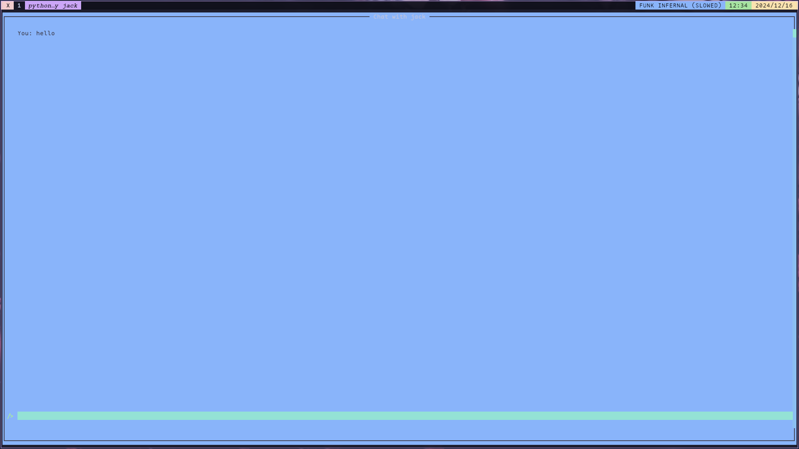

# OpenChat

ChatApp is a simple and intuitive chat application that allows users to communicate in real-time.

> **Note:** UI improvements are coming soon.

## Tech Stack

The initial version of OpenChat was built using the following technologies:

- **Python**: For frontend development and real-time communication.
- **Bun (TypeScript) + Hono**: For backend services and logic.

The new version of OpenChat has been upgraded with the following technologies:

- **Zig**: For improved performance and system-level programming.

## Old Code Base

The old code base can be found in the `log` folder for reference and historical purposes.
